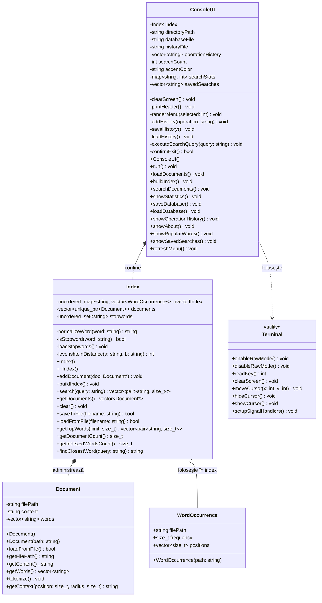

# Txt Search Engine

Aplicație de tip **motor de căutare pentru fișiere `.txt`**, realizată în **C++17** pentru proiectul de Programare Orientată pe Obiecte. Programul încarcă documente text dintr-un director local, construiește un **index inversat** și permite căutarea rapidă a cuvintelor, afișând documentele în care apar, frecvența aparițiilor și un scurt context.

## Cuprins

- [Descriere](#descriere)
- [Funcționalități](#funcționalități)
- [Tehnologii folosite](#tehnologii-folosite)
- [Structura proiectului](#structura-proiectului)
- [Arhitectură](#arhitectură)
- [Diagramă UML](#diagramă-uml)
- [Compilare și rulare](#compilare-și-rulare)
- [Ghid de utilizare](#ghid-de-utilizare)
- [Persistența datelor](#persistența-datelor)
- [Concepte POO folosite](#concepte-poo-folosite)
- [Exemplu flux de lucru](#exemplu-flux-de-lucru)
- [Autor](#autor)

## Descriere

`Txt Search Engine` este o aplicație de consolă care indexează o colecție de documente locale și oferă o interfață interactivă pentru căutarea termenilor în acele documente.

În loc să parcurgă fiecare fișier la fiecare căutare, aplicația construiește un **index inversat**: fiecare cuvânt normalizat este asociat cu documentele în care apare și cu frecvența aparițiilor. Astfel, căutările devin mai eficiente după etapa de indexare.

Aplicația include și o interfață TUI simplă, cu meniu navigabil din tastatură, culori ANSI, bară de progres, istoric de operații și salvarea listei de documente indexate într-un fișier local.

## Funcționalități

- Încărcarea automată a fișierelor `.txt` din directorul `documente/`.
- Construirea unui index inversat pe baza cuvintelor din documente.
- Normalizarea cuvintelor prin conversie la litere mici și eliminarea semnelor de punctuație.
- Ignorarea unor cuvinte comune, precum stopwords în română și engleză.
- Căutarea unui cuvânt în documentele indexate.
- Sortarea rezultatelor după frecvența aparițiilor în document.
- Afișarea unui scurt context pentru primul rezultat găsit în fiecare document.
- Sugestie de corectare pentru cuvinte apropiate, folosind distanța Levenshtein.
- Afișarea statisticilor despre documente și cuvinte indexate.
- Afișarea topului celor mai frecvente cuvinte după numărul de documente în care apar.
- Istoric de operații salvat în `istoric_operatii.txt`.
- Listă cu ultimele căutări efectuate în sesiunea curentă.
- Schimbarea temei de culoare din interfață.
- Salvarea și încărcarea bazei de date locale `search_index.db`.

## Tehnologii folosite

- **C++17**
- **STL**: `vector`, `string`, `unordered_map`, `unordered_set`, `map`, `memory`
- **Filesystem API**: citirea fișierelor din directorul `documente/`
- **Programare orientată pe obiecte**
- **Makefile** pentru compilare
- **ANSI escape codes** și `termios` pentru interfața din terminal

## Structura proiectului

```text
.
├── ConsoleUI.cpp / ConsoleUI.h      # Interfața utilizatorului și meniul principal
├── Document.cpp / Document.h        # Încărcarea, stocarea și tokenizarea documentelor
├── Index.cpp / Index.h              # Indexul inversat și logica de căutare
├── Terminal.cpp / Terminal.h        # Funcții pentru terminal: raw mode, taste speciale, cursor
├── main.cpp                         # Punctul de intrare al aplicației
├── Makefile                         # Reguli pentru compilare și rulare
├── documente/                       # Directorul cu fișiere .txt de indexat
├── search_index.db                  # Fișier pentru salvarea listei de documente indexate
└── istoric_operatii.txt             # Istoricul operațiilor efectuate
```

## Arhitectură

Proiectul este împărțit în clase cu responsabilități clare:

### `Document`

Reprezintă un document text. Clasa se ocupă de:

- citirea conținutului din fișier;
- tokenizarea textului în cuvinte;
- păstrarea conținutului și a listei de cuvinte;
- extragerea unui context în jurul unui cuvânt găsit.

### `Index`

Reprezintă motorul de indexare și căutare. Clasa se ocupă de:

- administrarea documentelor încărcate;
- construirea indexului inversat;
- normalizarea cuvintelor;
- eliminarea stopwords;
- căutarea termenilor;
- sortarea rezultatelor după frecvență;
- salvarea și încărcarea listei de documente;
- calcularea cuvântului apropiat prin distanța Levenshtein.

### `ConsoleUI`

Gestionează interacțiunea cu utilizatorul. Clasa se ocupă de:

- afișarea meniului principal;
- încărcarea documentelor;
- pornirea indexării;
- rularea căutărilor;
- afișarea statisticilor;
- gestionarea istoricului;
- schimbarea temei de culoare;
- afișarea informațiilor despre aplicație.

### `Terminal`

Conține funcții utilitare pentru lucrul cu terminalul:

- activarea și dezactivarea modului raw;
- citirea tastelor speciale;
- curățarea ecranului;
- ascunderea și afișarea cursorului;
- tratarea semnalelor de întrerupere.

## Diagramă UML

Diagrama de mai jos prezintă clasele principale ale aplicației și relațiile dintre ele:



Relațiile importante sunt:

- `ConsoleUI` conține un obiect `Index` și coordonează operațiile aplicației.
- `Index` administrează documentele prin `std::unique_ptr<Document>`.
- `Index` folosește `WordOccurrence` pentru a memora aparițiile unui cuvânt într-un document.
- `ConsoleUI` folosește funcțiile utilitare din `Terminal` pentru interfața în consolă.


## Compilare și rulare

### Cerințe

Ai nevoie de:

- compilator C++ cu suport pentru C++17, de exemplu `g++`;
- utilitarul `make`;
- sistem compatibil cu `termios`, de exemplu Linux sau macOS.

### Compilare

```bash
make
```

### Rulare

```bash
./search_engine
```

### Curățarea fișierelor generate

```bash
make clean
```

### Compilare și rulare rapidă

```bash
make run
```

## Ghid de utilizare

La pornire, aplicația afișează meniul principal. Navigarea se face cu tastele:

```text
↑ / ↓   Navigare prin meniu
Enter   Selectarea opțiunii curente
T       Schimbarea temei de culoare
```

Opțiunile disponibile în meniu sunt:

| Opțiune | Descriere |
| --- | --- |
| 1 | Încarcă documente din directorul `documente/` |
| 2 | Construiește indexul inversat |
| 3 | Caută un cuvânt în documente |
| 4 | Afișează statistici despre sistem |
| 5 | Salvează baza de date locală |
| 6 | Încarcă baza de date locală |
| 7 | Afișează istoricul operațiilor |
| 8 | Schimbă tema de culori |
| 9 | Afișează informații despre aplicație |
| 10 | Afișează cel mai căutat cuvânt din sesiune |
| 11 | Afișează căutările salvate în sesiunea curentă |
| 12 | Reafișează meniul |
| 0 | Ieșire din aplicație |

## Persistența datelor

Aplicația folosește două fișiere pentru păstrarea datelor între rulări:

- `search_index.db` — salvează lista documentelor încărcate. La încărcare, documentele sunt citite din nou, iar indexul este reconstruit.
- `istoric_operatii.txt` — salvează ultimele operații efectuate de utilizator.

La pornire, dacă fișierul `search_index.db` există, aplicația încearcă să încarce automat documentele salvate anterior.

## Concepte POO folosite

Proiectul folosește următoarele concepte de Programare Orientată pe Obiecte:

- **Încapsulare**: datele interne ale claselor sunt private și accesate prin metode publice.
- **Abstracție**: fiecare clasă ascunde detaliile de implementare și expune operații clare.
- **Compoziție**: `ConsoleUI` conține un obiect `Index`, iar `Index` administrează obiecte `Document`.
- **Separarea responsabilităților**: fiecare clasă are un rol distinct în aplicație.
- **Gestionarea resurselor**: documentele sunt administrate prin `std::unique_ptr`, reducând riscul scurgerilor de memorie.

## Exemplu flux de lucru

1. Adaugă fișiere `.txt` în directorul `documente/`.
2. Rulează aplicația:

   ```bash
   ./search_engine
   ```

3. Alege opțiunea **1** pentru încărcarea documentelor.
4. Alege opțiunea **2** pentru construirea indexului.
5. Alege opțiunea **3** și introdu cuvântul căutat.
6. Consultă rezultatele afișate: document, frecvență și context.
7. Alege opțiunea **5** pentru salvarea bazei de date.

## Observații

- Căutarea funcționează pe cuvinte individuale, nu pe fraze complete.
- Fișierele indexate trebuie să aibă extensia `.txt`.
- Directorul implicit pentru documente este `documente/`.
- Cuvintele comune definite ca stopwords nu sunt indexate.
- Sugestiile de corectare apar doar dacă există un cuvânt apropiat în index.

## Autor

**Podlisnic Marius**

Proiect realizat în C++ pentru disciplina Programare Orientată pe Obiecte.
